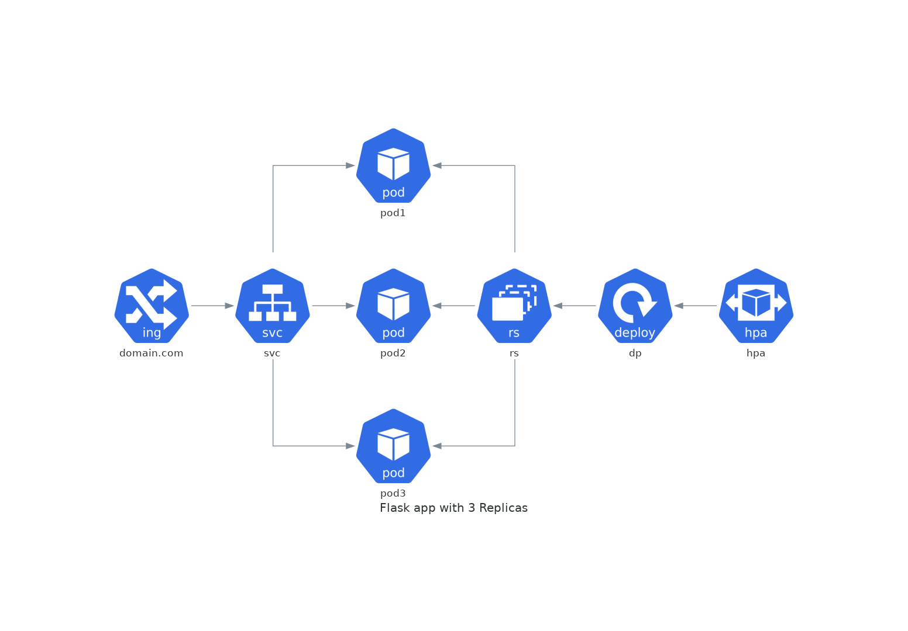

# simple-cloud-native-app
[](https://github.com/atrakic/simple-cloud-native-app/actions/workflows/ci.yml)
[](https://github.com/atrakic/simple-cloud-native-app/actions/workflows/release.yml)

A sample repository with as-simple-as-possible demonstration of running and deploying cloud native (Flask) app on kubernetes.


## Deployment
* GH actions used:
  * actions/checkout
  * docker/login-action
  * docker/metadata-action
  * docker/build-push-action
  * azure/k8s-set-context

* GH Workflows:
  * [test.yml](.github/workflows/test.yml) lint, functional tests (TODO), etc.
  * [ci](.github/workflows/ci.yml) runs on each PR spins up a throw-away [k3d single cluster](https://github.com/AbsaOSS/k3d-action) and deploys flask app
  * [release](.github/workflows/release.yml) from main branch deploys flask app on k8s

* To deploy container image create [github secrets](https://docs.github.com/en/actions/reference/encrypted-secrets):
  * [DOCKERHUB_USERNAME](https://docs.docker.com/docker-id/)
  * [DOCKERHUB_TOKEN](https://docs.docker.com/docker-hub/access-tokens/)

* To deploy app with [deployment script](scripts/deploy.sh) on your k8s own cluster, create additional github secrets:
  * [KUBE_CONFIG](https://kubernetes.io/docs/concepts/configuration/organize-cluster-access-kubeconfig/)
  * [INGRESS_HOST](https://kubernetes.io/docs/concepts/services-networking/ingress/#name-based-virtual-hosting)

## Demo
- Production deployment:

```
$ kubectl -n prod get all
NAME                                READY   STATUS    RESTARTS   AGE
pod/simple-cloud-native-app-7cdbf5f794-cvscr   1/1     Running   0          38m
pod/simple-cloud-native-app-7cdbf5f794-z79m2   1/1     Running   0          38m
pod/simple-cloud-native-app-7cdbf5f794-hv9hn   1/1     Running   0          38m

NAME                   TYPE        CLUSTER-IP      EXTERNAL-IP   PORT(S)   AGE
service/simple-cloud-native-app   ClusterIP   10.43.249.228   <none>        80/TCP    38m

NAME                           READY   UP-TO-DATE   AVAILABLE   AGE
deployment.apps/simple-cloud-native-app   3/3     3            3           38m

NAME                                      DESIRED   CURRENT   READY   AGE
replicaset.apps/simple-cloud-native-app-7cdbf5f794   3         3         3       38m
```

- Run app

```
# list all items
$ curl -sSL http://$INGRESS_HOST

# get item
$ curl -sSL http://$INGRESS_HOST/api/v1/2

# add new item if not exits (new items cleared after each redeploy)
$ curl -sSL -XPOST -d'{"id": "22", "name": "foo.bar"}' -H 'Content-type: application/json' http://$INGRESS_HOST/api/v1/add

# prints runtime version
$ curl -sSL -XGET http://$INGRESS_HOST/version

# total number of
$ curl -sSL -XGET -H "Content-type: application/json" http://$INGRESS_HOST:80 | jq -S "length"

```
